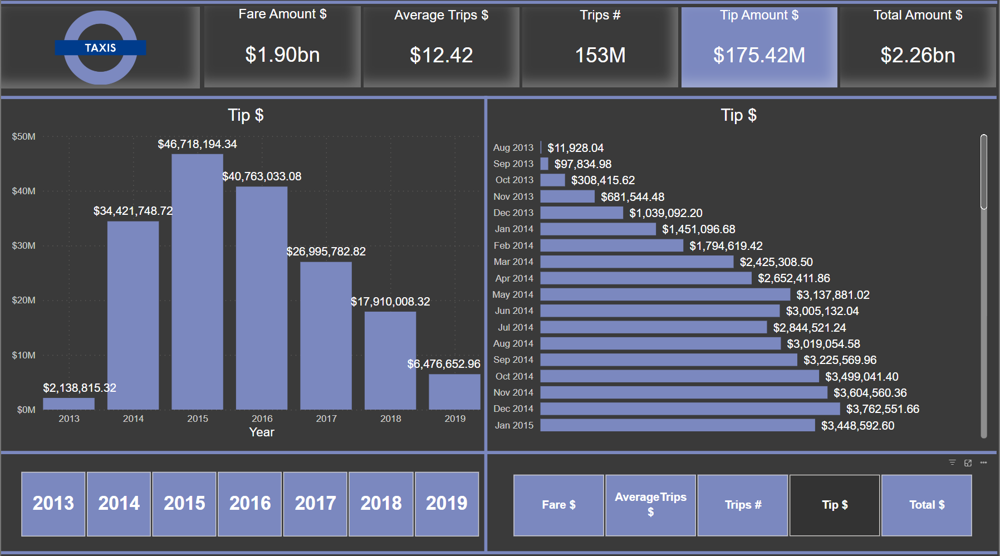
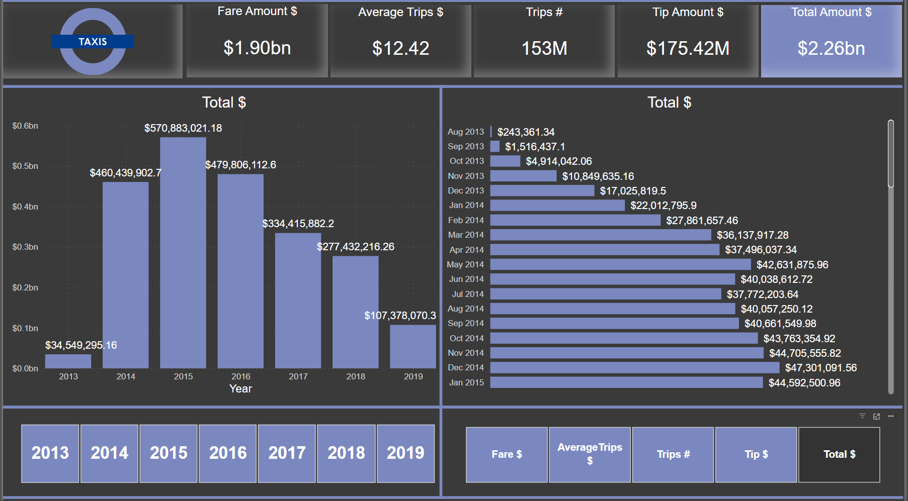

# **NYC Fast Taxis Company**
## **NYC Fast Taxis Company Power BI Report**

---
**Document Author**                                                   
|Date |Author|Version|Role|                   
|:----|:-----|:------------|:----|                                        
|08/01/2023|Fatjan Paloja| 1.0| Power BI Consultant 
## Introduction

Microsoft last couple of month has released a public preview of **Microsoft Fabric**. Me as Power BI developer and tech enthusiast I started to experiment with it and I thought maybe it is very good to document as the project on GitHub for my protfolio. This was the starting point, the project was quite simple, the main thing I wanted to experiment with was Taxi Data as sample data which is almost 160 milion rows, the connection as Direct lake and PowerBI desktop mixed mode (Direct query to AS and Import)

**_Datasets, model and report are not representing any real company or real data_**

## Statement

Simulation:
Fictive **Taxi** company want to implement new **Microsoft Fabric** capabilities to their BI analysis. They want real time data analysis so we have agreed to use Direct Query over AS and import as storage mode in Power BI.
  
## BI Requirements

Simulate the client **Taxi** Company requirement of measuring these metrics:
- Fare Amount Value
- Total Amount Value
- Tip Amount Value
- Count of trips
- Average Trips Amount

These metrics should be compared on calendar base year, month, day.
 
_I havent gone to deeper analysis of hour, minute, most frequent hours of the day_
  
## Skills demonstrated

As I mention project is quite simple, some of the skills shown in this project are field parameters, card highlighting when same measure is clicked, UI appearance... Usage of field parameters was ment to use the same visual interface to measure different metrics. Of course we can apply drillthough to another page and use tooltips for additional information.
## Project Steps

- Created a new workspace named Fatjan Paloja Fabric_Test and select a trial of Microsoft Fabric for 60 day.
   
   
 

- Created a lake house
   
   
 
- Data source
   
  Add new Data pipeline - TaxiDataPipeline_Directlake
   
   

- Load to Delta table data preview
   
   
  

- Link a Pipeline to Outlook and Teams - on data refresh succes they sent a mesage you write for example "Data is refreshed succesfully"
   
   
  
   
   
- On SQL Endpoint I created a View and added new date only column
   
   
  

- Model view of storage mode as Datalake
   
   
   
   
   

- Modeling
   
  Connected Power BI desktop to Onelake data hub - LakeHouses preview and loaded data as Direct Query over AS and for calendar table I used SqlBI Bravo tool which has builded for me Calendar Table with DAX (You can use a Calendar Table builded in Dataflow Gen2 also). I have created relationship between Calendar Table and Taxi data on Date columns
   
   

- Measures, Calculated Table and Field Parameter
   
  I have used VertiPaq Analyzer to list the measures for showing here. The procedure is open the DaxStudio in Power BI external tools, in advanced tab export metrics, then connect Vertipaq Analyzer to connect to .vpax file.
   
   
  

## Visualizations:

  The report is single paged and intended for simplicity of usage. We are measuring five metrics: Fare Amount, Average Trips Amount, Number of Trips, Tip Amount and Total Amount in single page - you can change the metrics in slicer down right also we have a slicer down left for years you want to analyze.
When you click a particular metrics slicer down right that BAN number which is measured is highlighted. For the color I have chosed #7B88BF to be in harmony with the fictional company logo.
   

  
     
 ## Analysis:
For seven years of analysis NYC Taxis Company had more than 153 milion trips in total
|Year|Trips_#|              
|:----------|:----------|
|2013   |2,421,622|
|2014  |31,674,002|
|2015  |38,467,530|
|2016  |32,771,064|
|2017  |23,481,028|
|2018  |17,613,798|
|2019   |6,595,934|
   
As we see from data the year 2015 has maximum trips compared to other years with 38,467,530 also maximum transaction per month was in May2015 with 
3,573,696 trips
  

 
For seven years of analysis NYC Taxis Company had more than 1.90 Bn fare amount in total
|Year|Fare Amount $|              
|:----------|:----------|
|2013   |$ 30,038,429.24|
|2014  |$ 395,246,914.90|
|2015  |$ 474,342,003.48|
|2016  |$ 397,734,160.50|
|2017  |$ 276,958,721,38|
|2018  |$ 236,515,106.90|
|2019  |$ 90,187,147.06|
   
As we see from data the year 2015 has maximum fare Amount compared to other years with $ 474,342,003.48 also maximum fare amount per month was in May2015 with $ 45,470,410.92 dollars
  

For seven years of analysis NYC Taxis Company has in total $ 12.42 average dollar per trip
|Year|Average Amount $|              
|:----------|:----------|
|2013   |$ 12.40|
|2014   |$ 12.48|
|2015   |$ 12.33|
|2016   |$ 12.14|
|2017   |$ 11.79|
|2018   |$ 13.43|
|2019   |$ 13.67|
   
As we see from data the year 2019 has greater average per trip compared to other years with $ 13.67 also maximum average per trip for year month was in Nov2018 with $ 14.42 dollars/Trip
  

For seven years of analysis NYC Taxis Company has in total $ 175.42 Milion dollar tips
|Year|Tips Amount $|              
|:----------|:----------|
|2013   |$ 2,138,815.32|
|2014   |$ 34,421,748,72|
|2015   |$ 46,718,194.34|
|2016   |$ 40,763,033.08|
|2017   |$ 26,995,782,82|
|2018   |$ 17,910,009.32|
|2019   |$ 6,476,652.96|
   
As we see from data the year 2015 has maximum Tips in dollars compared to other years with $ 46,718,194.34 also maximum ayear month was in May2015 with $ 4,572,791.96 dollars.
  

For seven years of analysis NYC Taxis Company has more than $ 2.26 Bilion dollar total sales
|Year|Tips Amount $|              
|:----------|:----------|
|2013   |$ 34,549,295.16|
|2014   |$ 460,439,902.70|
|2015   |$ 570,883,021.18|
|2016   |$ 479,806,112.60|
|2017   |$ 334,415,882.20|
|2018   |$ 277,432,216.26|
|2019   |$ 107,378,070.30|
   
As we see from data the year 2015 has maximum amount in dollars compared to other years with $ 570,883,021.18 also maximum year month was in May2015 with $ 54,499,244.10 dollars.
  

Interact with report 

 
## Conclusion
  
This project as I mentioned above was only to experiment with Microsoft Fabric also to showcase some of power bi attributes. 

